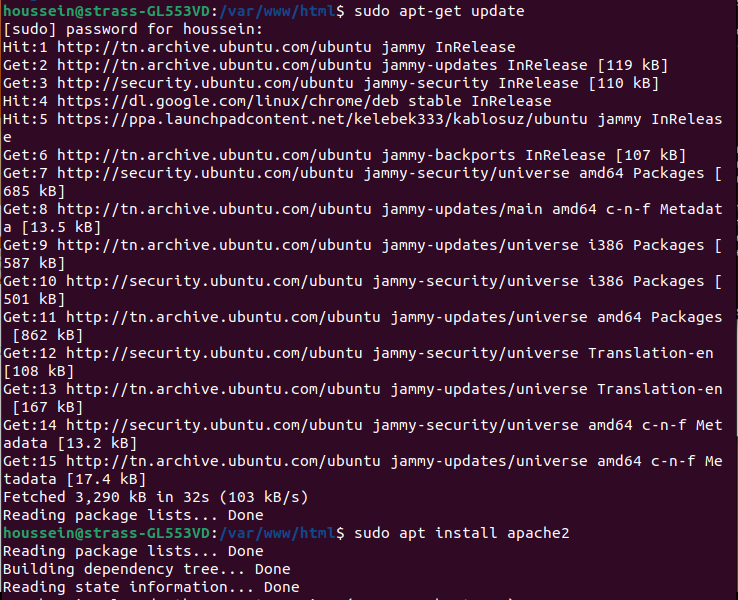
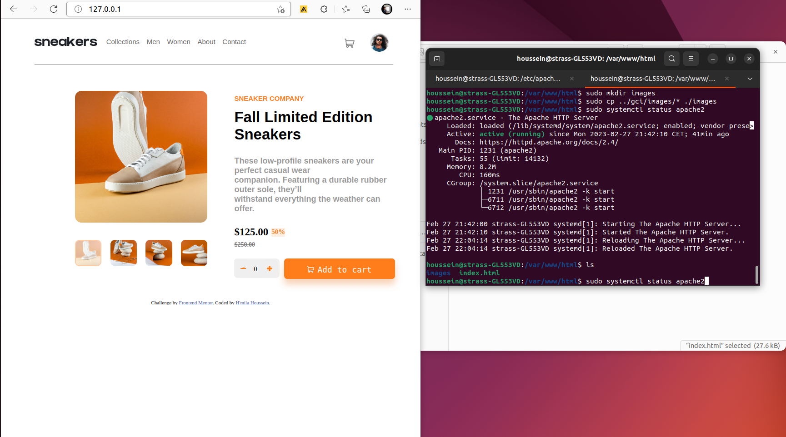

# gcp-project

These steps outline how to host a website with HTML, CSS, and JS files using Apache web server. 
Let's get started!

# Step 1

Let's make sure our machine is updated and install the Apache web server using the following commands: 
sudo apt-get update
sudo apt install apache2 

# Step 2

We need to navigate to the directory /var/www/html and remove the default Apache website file by running: 
cd /var/www/html\n
sudo rm *\n

Then, we need to create a new index.html file and upload our code into that file using an editor such as nano or gedit. The CSS and JS code should be linked internally to the HTML file. If there are any images,  we can create a new folder called "images" in the same directory.

touch index.html 
mkdir images  

# Step 3

We need to restart our web server using the following command:

sudo systemctl reload apache2

To check the status of our web server, we can run:

sudo systemctl status apache2

# Step 4

We can test our web server by typing 127.0.0.1 in our browser, and everything should work correctly.

